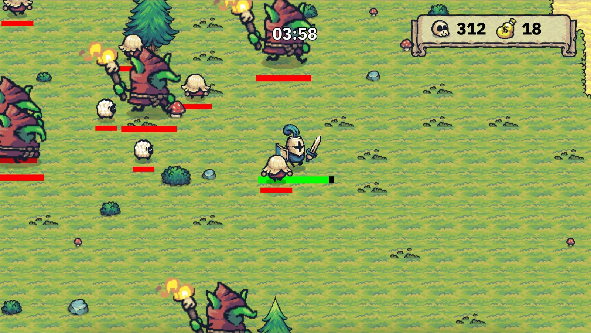

# Tiny Survivors
Jogo criado no Godot para o bootcamp da DIO **Santander 2024 - Criando Jogos com Godot**.

	

## Como o jogo está até agora
- Movimento do personagem com 1 tipo de ataque que vai em todas as direções;
- 1 ritual automático;
- 3 inimigos diferentes;
- Coleta de itens deixados pelos inimigos após a morte;
- Spawn de inimigos com sistema de ondas;
- Restart automático após o Game Over;
- UI com contagem de inimigos derrotados, ouro e tempo de jogo.

##  Coisas que gostaria de implementar:

### UI
- Menu principal;
- Tela de settings;
- Pause;
- Customizar barra de vida do jogador e dos inimigos;
- Tela de level up.

### Gameplay
- Subir de nível de acordo com a quantidade de inimigos derrotados;
- Adicionar poderes e inimigos conforme o nível do jogador.